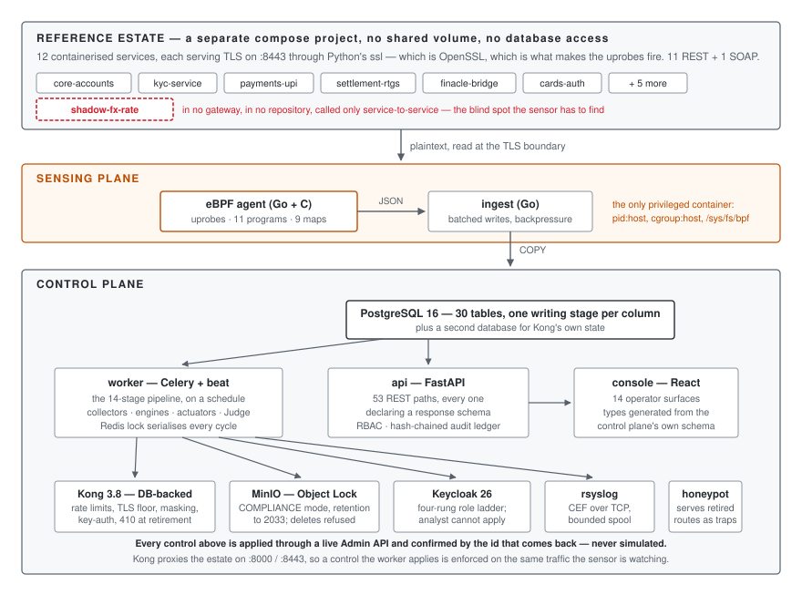
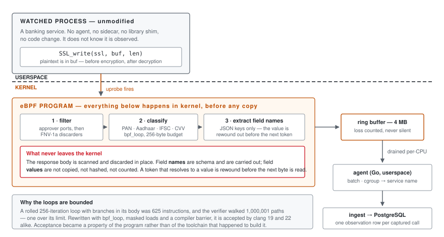
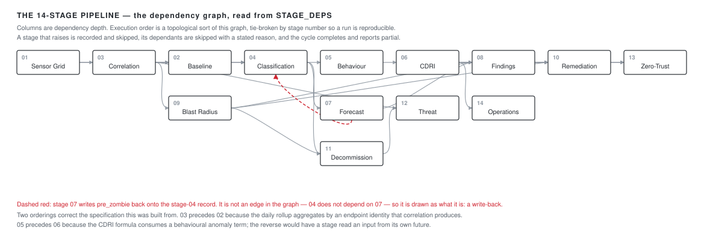
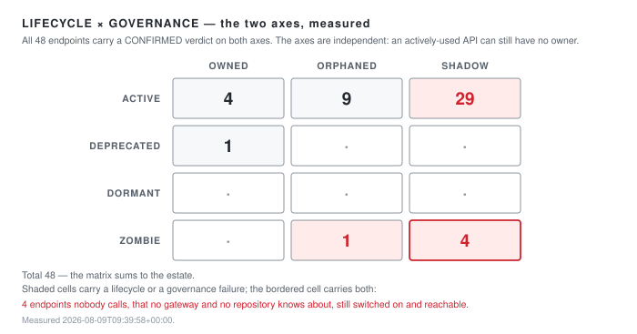
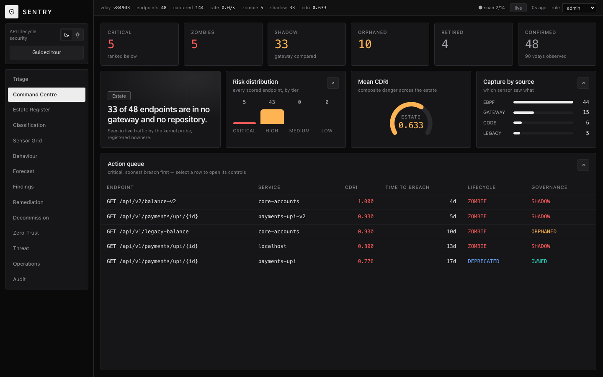
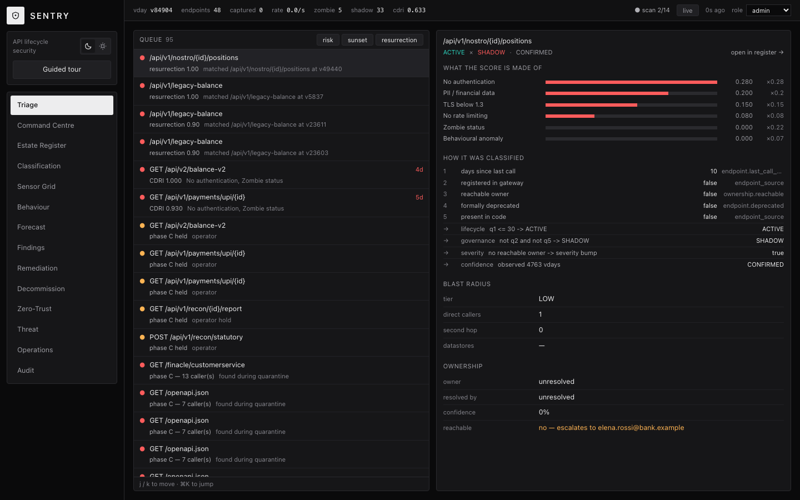
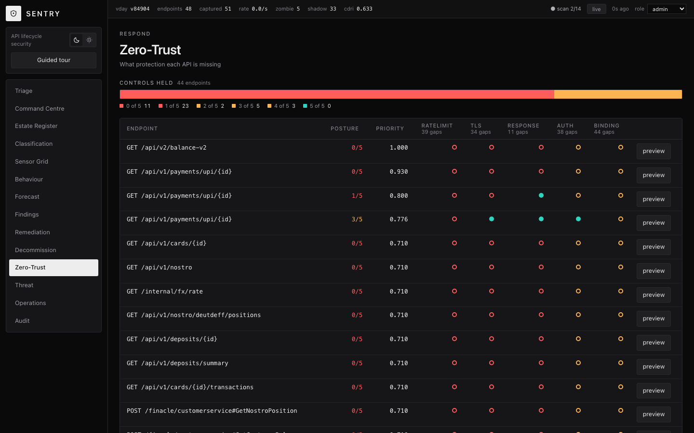

# SENTRY

**An API lifecycle security platform for banking estates**

*&lt;author names&gt;* · August 2026

Repository — <https://github.com/sohamkamat28/sentry>
Demo — <https://sohamkamat28.github.io/sentry/>

> The demo serves a frozen capture of a real run. The subject of this report is the
> system that produced it: a Docker Compose stack of 25 services, a kernel sensor,
> and a fourteen-stage analysis pipeline. That system needs a privileged Linux host
> and cannot be hosted on a static site.

---

## Abstract

Banks accumulate APIs faster than they retire them. An endpoint outlives the team
that wrote it, drops out of the gateway registry, and keeps serving account
numbers to nobody in particular. Nothing in the usual toolchain finds it: a
gateway only knows what was registered with it, and a code scanner only knows
what is still in a repository.

SENTRY finds those endpoints by watching traffic from inside the Linux kernel,
then classifies, scores, and retires them through a workflow that proves what
breaks before anything is switched off. It is built on one rule: **no figure is
ever invented.** There is no seeding script. Every number in this report was
produced by a sensor reading or by an engine computing over sensor output, in a
single measured run whose raw output is committed alongside this document.

In that run the system discovered **48 endpoints** across twelve TLS banking
services, of which **33 appear in no gateway and no code repository**, and
classified every one with a replayable decision trace. All **14 pipeline stages**
completed in **101 seconds** over **263,765 records**.

---

## 1 · Problem and approach

An API estate decays in two independent ways, and most tooling conflates them.

The first is **lifecycle**: is anyone still calling this? An endpoint nobody has
called in months is not harmless — it is unmonitored, unpatched, and still
reachable. The second is **governance**: does anyone own this? An endpoint can be
under heavy load and still have no team that would be paged if it leaked.

These axes are independent, and the interesting failures live where they cross.
An API that is both silent and unowned is one nobody will notice, nobody will
fix, and nobody will miss until it appears in a breach report.

Finding them requires seeing traffic that no registry describes. SENTRY attaches
uprobes to the TLS library functions every service already calls, reads request
and response metadata at the moment the plaintext exists in memory, and builds
its inventory from what it observes rather than from what it was told. A
registry can only report what was registered with it; a kernel probe reports what
actually happened.

### The constraint that shaped everything

**Nothing in this system invents an endpoint, a call count, or a risk input.**

That rule is easy to state and expensive to keep. It means the reference estate
had to be real services speaking real TLS, not fixtures. It means an endpoint the
system cannot see has to be absent rather than assumed. It means a degraded
sensor must produce *fewer* rows, never plausible ones — and that a count of zero
and a failure to read must be visibly different on screen, because a blind
estate and a quiet estate look identical otherwise.

Its sharpest expression is the endpoint `GET /internal/fx/rate`. It runs in the
estate, it is in no gateway and in no scanned repository, and the traffic driver
never calls it — it is reached only when two other services call it internally.
It appears in the results below because a kernel probe watched those calls
happen. The blind-spot claim is therefore a measurement rather than an assertion.

> **On the repository's two halves.** `design/` holds an earlier specification for
> a system called SENTINEL, together with a Next.js prototype that ran on
> synthetic data. `sentry/` is the implementation described here: built from those
> specifications, against a live estate, with nothing synthetic in it. Where the
> two disagree, this document follows the running code.

---

## 2 · System architecture



Three planes, separated so that discovery cannot cheat.

The **reference estate** is its own Compose project. It shares no volume and no
database credential with the platform, so the only way SENTRY learns anything
about it is by observing it. Twelve services speak TLS on `:8443` through
Python's `ssl` module — which is OpenSSL, which is precisely what makes the
sensor's uprobes fire. Eleven are REST and publish OpenAPI; one is SOAP and
publishes a WSDL.

The **sensing plane** is the eBPF agent and the ingest service, both in Go. The
agent is the single privileged container in the deployment: `pid: host`,
`cgroup: host`, and the BPF filesystem mounted. Everything else runs unprivileged.

The **control plane** is Python. A FastAPI service exposes 53 REST paths, every
one declaring a response schema, from which the console's TypeScript types are
generated rather than hand-written. A Celery worker runs the fourteen stages on a
schedule, with a Redis lock guaranteeing exactly one cycle at a time.

**Why the language split.** Go sits on the hot path because the agent decodes a
ring buffer and the ingest service writes batches under load, and neither can
afford a garbage collector pause or a GIL. Python sits on the analysis path
because that is where scikit-learn, networkx, datasketch and tree-sitter live,
and a fourteen-stage pipeline that runs every six virtual hours is not
latency-bound.

**The virtual clock.** Lifecycle rules are written in days — an endpoint is dormant
after 30, a zombie after 90. Waiting 90 real days to test a 90-day rule is not a
test. A single `vclock` row defines a scale factor, all analysis reads time
through it, and one virtual day elapses in 30 seconds. Only the clock is
accelerated; the traffic and the analysis are real.

| Component | Language | Responsibility |
|---|---|---|
| `agent` | Go + C (eBPF) | uprobes on OpenSSL; classifies data classes in kernel |
| `ingest` | Go | observation intake, batching, backpressure |
| `api` | Python / FastAPI | 53 REST paths, RBAC, hash-chained audit ledger |
| `worker` | Python / Celery | the fourteen stages, collectors, actuators, the Judge |
| `core` | Python | 30-table domain model, virtual clock, config |
| `console` | TypeScript / React | 14 operator surfaces, types generated from the API |
| `honeypot` | Go | serves retired routes as instrumented traps |
| `estate` | Python | 12 TLS banking services and a traffic driver |

Roughly 46,000 lines, of which about 7,800 are tests.

---

## 3 · The kernel sensor



The agent attaches uprobes to `SSL_write` and `SSL_read` and their `_ex` forms,
plus Go's `crypto/tls` entry points — eleven programs against nine maps. At the
moment those functions are called the plaintext is in a buffer, before encryption
on the way out and after decryption on the way in. The watched process is
unmodified: no sidecar, no library shim, no code change.

**The `_ex` forms are load-bearing.** CPython links against `SSL_write_ex` and
`SSL_read_ex` and nothing else. Without those four programs an estate of Python
services produces no capture whatsoever — a failure the classic probes cannot
reveal, because they attach cleanly and simply never fire.

### Privacy as control flow

The response body is scanned in kernel for data classes — PAN, Aadhaar, IFSC,
account number, card, CVV, date of birth — and then discarded in place. What
leaves the kernel is the *class mask* and the JSON *key names*; the values do
not. A name is schema: `accountNumber` describes the shape of a response and
carries none of the account number.

The guarantee is structural rather than promissory. When the parser encounters a
token that resolves to a value, it rewinds out of the buffer before the next byte
is read. There is no execution path on which a value is still in scope when the
next token begins. An audit over every stored field name found **zero**
identifier-shaped strings.

### The verifier

The in-kernel classifier was the hardest part of the build, and the difficulty
was not the algorithm.

A rolled 256-iteration loop with branches in its body compiled to **625
instructions**. The BPF verifier walks every path rather than every instruction,
and it processed **1,000,001** of them before rejecting the program at its limit
of 1,000,000. Worse, the outcome was toolchain-dependent: clang 22 produced an
object this kernel accepted, and clang 19, from identical source, produced one it
rejected at exactly the same ceiling.

Three changes fixed it. `bpf_loop` moved iteration into a helper the verifier
does not have to unroll — and the classifier and the field extractor were given
*separate* loops, because two loops are two budgets. Every load and store was
clamped and masked, so bounds became a property the verifier could read directly.
A compiler barrier was inserted where a clamp alone was insufficient, because the
compiler kept a pre-clamp copy in another register and the verifier still saw an
unbounded scalar.

The result is a program whose acceptance is a property of the program rather than
of the toolchain that happened to build it.

### What the sensor did in this run

The agent resolved BTF, loaded all eleven programs, and attached to the estate's
OpenSSL. During the measured window it reported:

```
filter    captured 4159  emitted 2772  ringbuf_lost 0
          dropped_cgroup 0  dropped_port 0  dropped_discarder 0
shipping  sent 1470  body_merged 2665  queue_dropped 0  callers_named 5
```

Zero ring-buffer loss and zero queue drops. Attach failures against one unrelated
container are logged every reconcile pass rather than suppressed — the agent is
noisy about what it could not instrument, which is the correct behaviour for a
component whose silence would otherwise be indistinguishable from success.

---

## 4 · The fourteen-stage pipeline



Stages declare their dependencies as data. The graph is validated at import time,
execution order is a topological sort tie-broken by stage number for
determinism, and a stage that raises is recorded and skipped — its dependants are
skipped with a stated reason, and the cycle completes and reports partial rather
than aborting.

Two orderings are deliberate corrections of the specification they were built
from. **Stage 03 runs before 02**, because the daily rollup aggregates by endpoint
and endpoint identity is what correlation produces. **Stage 05 runs before 06**,
because the CDRI formula consumes a behavioural anomaly term; the reverse would
have a stage read an input from its own future. One write-back is declared and
legal: stage 07 writes `pre_zombie` onto the stage-04 record. It is not an edge
in the graph — 04 does not depend on 07 — so it constrains nothing, which is
why the figure draws it apart from the dependencies.

**Scoring.** CDRI is a weighted composite of six terms — missing authentication
(0.28), zombie status (0.22), data exposure (0.20), TLS below 1.3 (0.15), no rate
limiting (0.08), behavioural anomaly (0.07). The console renders the terms and
their contributions beside the total, because a score an operator is asked to act
on has to be decomposable or it is only an assertion.

**The Judge.** Nothing reaches the gateway on the strength of a proposal. Stage 10
generates a candidate Kong plugin configuration, then replays the endpoint's own
captured traffic through a shadow pair on the live gateway and measures schema
conformance, error rate, exposure and latency. A control is applied only if it
passes, and `APPLIED` is set only when Kong returns a plugin id. Where the
service answers a bodyless request with a fault, request bodies are synthesised
from the endpoint's own OpenAPI or WSDL contract so the replay is meaningful.

---

## 5 · Results measured from a real run

Everything in this section comes from one frozen capture,
`report/evidence/00-bundle.json`, taken at **2026-08-09T09:39:58Z**. The tables
below are generated from that file; no figure is transcribed by hand.

### 5.1 What was discovered

Four collectors run independently and disagree on purpose.

| Source | Endpoints | Exclusive to it | Healthy |
|---|---:|---:|---|
| eBPF kernel probe | 44 | **28** | yes |
| Kong gateway registry | 15 | 3 | yes |
| Code repositories | 6 | 0 | yes |
| Legacy WSDL + registry | 5 | 1 | yes |
| **Sightings** | **70** | | |

Seventy sightings correlate to **48 distinct endpoints** — a dedup ratio of
**1.458**. The kernel probe is the *only* source for **28 of them**. That number
is the product: it is what a gateway registry and a code scan, together, cannot
see.

### 5.2 Lifecycle and governance



All 48 endpoints carry a `CONFIRMED` verdict on both axes, meaning each had
enough observed history for the confidence ramp to permit a decision. **33 are
SHADOW** — in no gateway and in no repository. Ten are ORPHANED: registered, but
with no resolvable owner. Five are OWNED.

Each verdict carries a replayable trace of the five questions asked, the answer,
and the column the answer came from. The screenshot in §5.5 shows one.

### 5.3 Pipeline execution

| # | Stage | Depends on | Records | ms |
|---:|---|---|---:|---:|
| 1 | Sensor Grid | — | 24 | 274 |
| 2 | Baseline | 1, 3 | 263,265 | 78,541 |
| 3 | Correlation | 1 | 43 | 912 |
| 4 | Classification | 2, 3 | 44 | 125 |
| 5 | Behaviour | 4 | 44 | 3,070 |
| 6 | CDRI | 5 | 44 | 31 |
| 7 | Forecast | 4 | 41 | 2,812 |
| 8 | Findings | 6, 7, 9 | 44 | 284 |
| 9 | Blast Radius | 3 | 48 | 20 |
| 10 | Remediation | 6, 8, 9 | 0 | 643 |
| 11 | Decommission | 4, 9 | 0 | 3,944 |
| 12 | Threat | 3, 11 | 0 | 10,629 |
| 13 | Zero-Trust | 6, 10 | 44 | 47 |
| 14 | Operations | 6 | 124 | 101 |
| | **Total** | | **263,765** | **101,433** |

Run 3132, scheduled, all fourteen stages `ok`. Wall clock was 101,468 ms against
101,433 ms of summed stage time — a 35 ms difference, so execution is effectively
serial. Stage 02 is 77% of the runtime and 99.8% of the records: the daily rollup
over the observation table dominates, and it is the obvious first target if this
ever needed to be faster.

### 5.4 Posture and evidence

**Zero-trust.** Across the 44 live endpoints, controls held: 11 endpoints hold
none of the five, 23 hold one, 2 hold two, 5 hold three, 3 hold four, and none
hold all five. The largest gaps are token binding (44), rate limiting (39) and
authentication (38).

**Behaviour.** The isolation forest fitted on 44 endpoints against a 30-endpoint
minimum, scored 48, and flagged 3.

**Findings.** 48 generated findings carrying **259 regulatory clause rows** across
five frameworks, each citing the specific clause and the evidence for it.

**The audit ledger.** 754 entries, hash-chained, verified intact with no break
point. Every operator action that changes state is in it, attributed to an email
rather than a UUID.

Three proofs were run against the live infrastructure:

**WORM immutability.** The archive written at retirement is stored under S3 Object
Lock in COMPLIANCE mode. Asking the system to verify its own archive:

```json
{ "object": "s3://sentry-worm/decommission/ep_8f29b4446fd86166/44710.json.gz",
  "lock_mode": "COMPLIANCE", "retain_until": "2033-08-02T17:57:28Z",
  "verified": true, "delete_refused_with": "InvalidRequest",
  "detail": "Object is WORM protected and cannot be overwritten" }
```

**The shadow endpoint.** `GET /internal/fx/rate` — `ACTIVE × SHADOW`, CDRI 0.71,
`auth = none`. Found by the kernel probe alone.

**The role boundary.** `POST /operations/scan` as `viewer` returns **403**; as
`analyst` and `approver` it returns **409 CYCLE_IN_PROGRESS** — past
authorization, refused by the Redis lock. The two failures are different for the
right reasons, and the 409 is itself the serialisation guarantee.

### 5.5 The console



The landing surface, reading live from the control plane. The header shows the
virtual day, the capture counter incrementing, and a scan in flight at stage 9 of
14.



One endpoint, fully decomposed: the six weighted CDRI terms and their
contributions, the five classification questions with the column each answer came
from, the blast radius, and an ownership record that resolved to nobody and
escalated.



Control posture across the estate — five controls per endpoint, held or missing,
with the estate-wide gap count in each column header.

### 5.6 Tests

| Suite | Runner | Result |
|---|---|---|
| `api/tests` + `worker/tests` | pytest | **428 passed** |
| `estate/driver` | pytest | 8 passed |
| `agent`, `ingest`, `honeypot` | go test | 9 packages, all `ok` |
| `console` | vitest | 38 passed |

The Python figure is what `pytest` collects under the configured test paths; it
supersedes the 393 and 425 quoted in earlier documents, both of which had gone
stale. A regression suite pins previously-found defects so they cannot return.

---

## 6 · Engineering decisions and trade-offs

**Kong in database-backed mode, not declarative.** Declarative mode is the more
fashionable choice and it makes the Admin API read-only — `POST /services`
returns 405. Stage 10's entire mechanism is Admin API writes. The YAML remains
the registry of record and is *imported* at bootstrap rather than mounted.

**MinIO Object Lock enabled at bucket creation.** Object Lock cannot be turned on
for an existing bucket. Getting this wrong means retirement archives to deletable
storage and nobody discovers it until the first audit. The bucket is created
`--with-lock` in a bootstrap job, and the worker fails its readiness check rather
than finding out at the first retirement.

**Deseasonalise before fitting the trend.** Holt's method applied to raw call
volume fitted the weekend dip as a downward trend and flagged **51 of 86** active
endpoints as heading for zombie status. Deseasonalising over one weekly period
first fixed it. The traffic driver now carries an explicit regression guard: a
service that grows while dipping at weekends, so a forecast that stops
deseasonalising fails a test rather than a demo.

**Two-hop cap on blast radius.** Unbounded graph traversal rated **108 of 125**
endpoints CRITICAL, which is the same as rating none of them.

**tree-sitter instead of line matching for the code collector.** A line-wise
matcher missed `router.HandleFunc(` with its path on the next line, and read
`"POST /api/v1/transfer"` twice — once correctly and once as a GET on a path
beginning `/POST`, inventing an endpoint that does not exist. That matters more
than it sounds: a route the collector cannot see is a route absent from the
`code` source, and absent from both code and gateway is the definition of SHADOW.

**A deliberate over-capture, kept in the record.** The sensor's approved-port list
originally included 443. The worker pulled Python dependencies over TLS during
build, and the agent dutifully registered **277 endpoints on
`files.pythonhosted.org`** as bank APIs. The fix was to narrow the port list; the
lesson is in the repository rather than edited out of it.

---

## 7 · Limitations

Stated plainly, because a system that only reports its successes is not
measuring anything.

**No load testing at production volume.** The pipeline has been run repeatedly
against a 48-endpoint estate. Nothing here establishes how it behaves at ten
thousand endpoints, and the stage-02 rollup is the obvious first thing to break.

**No precision or recall figures.** The estate contains a known shadow endpoint
and a known zombie, and the system finds both. That is a demonstration, not an
evaluation: there is no labelled ground truth, no baseline to compare against,
and no false-positive rate for shadow detection on an estate we did not build.

**The resurrection result is a single case.** Behavioural re-identification scored
0.882 against a 0.85 threshold with the nearest unrelated endpoint at 0.591; with
field shingles stripped it scores 0.800 and misses. That is one pair, `n = 1`. It
justifies the feature choice; it does not establish a detection rate.

**No per-endpoint latency was measured.** The schema carries `p95_latency_us` and
it is NULL for all 48 endpoints in this run. The ingest path deliberately stores
NULL rather than 0 for an unmeasured value, so the absence is honest — but it is
an absence.

**One latency figure exists and should not be read as steady state.** The oauth2
control was measured at 41.8 ms against a 10 ms budget. That was a single request
against a cold Kong route with router warm-up not separated out.

**Sensor coverage is host-dependent.** The agent captured cleanly here on Docker
Desktop's LinuxKit kernel, but it could not attach to one container whose libssl
the uprobe could not open, and it logs that failure every reconcile pass. On a
host without BTF the agent refuses to start rather than running blind.

**Two of the five zero-trust controls cannot be judged in this deployment.**
`mtls` needs client certificates and `dpop` needs a DPoP-capable caller, and this
estate provides neither. The Judge rejects both — correctly, but for a reason
about the harness rather than about the control. Only three of the five have been
measured end to end.

**Change requests are stubs.** The ServiceNow client has never run against a live
instance; every change request raised so far carries `stub = true`. The approval
workflow is modelled, not integrated.

**The pre-merge gate abstains more often than it fires.** It compares a pull
request's route declaration against the *declarable* projection of a retired
endpoint's fingerprint — method, response fields, data classes. A handler that
delegates its body to a shared helper the diff does not touch reveals none of
that, and the check abstains rather than passing quietly. Stage 12's runtime
detection is what covers that case, after the fact.

**The gRPC contract is declared but not wired.** `contracts/` defines a protobuf
observation message; the live wire format between agent and ingest is JSON over
HTTP. Reviewed and declined rather than left open: the agent and the ingest
receiver agree, nothing here is throughput-bound, and the change would put the
one path that cannot be re-run — live kernel capture — through a rewrite of both
ends. The proto remains the schema of record and the migration path.

**One collector diverges from its specification.** The design names `zeep` for
reading WSDL. `zeep` is a SOAP *client*; extracting operations from a contract
needs an XML parser, and the standard library's ElementTree is exact for it and
adds no dependency. The collector never calls a SOAP service, so the rest of
`zeep` would be unused.

---

## 8 · Running it

```bash
git clone https://github.com/sohamkamat28/sentry && cd sentry/sentry
docker network create sentry-net
docker compose -f deploy/compose/compose.yaml up -d
docker compose -f estate/compose.yaml up -d
```

The console is on <http://localhost:5173>, the control plane on
<http://localhost:8080>. The first scan cycle begins on the scheduler's next
tick; `POST /api/v1/operations/scan` forces one. Everything that does not need
Docker runs with `make verify`, which needs Go and an LLVM with a `bpf` target.

The eBPF agent needs a Linux host with BTF. On macOS it runs under Docker
Desktop's LinuxKit kernel, with the caveat noted in §7.

---

*All figures in §5 derive from `report/evidence/00-bundle.json`, captured
2026-08-09T09:39:58Z, alongside the transcripts in the same directory.*
